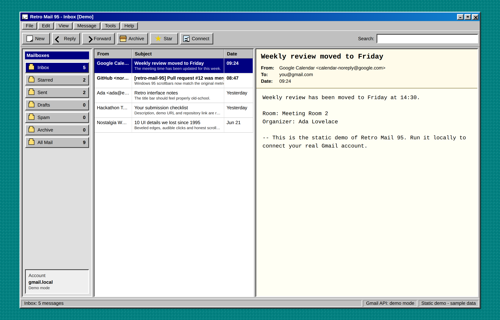

# Retro Mail 95

A Gmail client that looks like it shipped on a floppy disk in 1995 — and runs entirely on your own machine.

**[Live demo](https://YOUR-USERNAME.github.io/retro-mail-95/)** · sample data, no login required



## What it is

Retro Mail 95 is a local-first Gmail client with a pixel-faithful Windows 95 interface: beveled buttons, a blue title bar, a working menu bar, a folder pane, a reading pane and a status bar. Behind the nostalgia it is a real mail client — it talks to the Gmail API over OAuth 2.0 and can read, search, send, reply, forward, archive, star and mark messages.

The whole backend is a single Python file with **zero third-party dependencies** — just the standard library. No Node build step, no framework, no `pip install`. Clone it, drop in your Google OAuth credentials, double-click, and it opens in your browser.

## Why

Two ideas, one project:

- **The interface.** Modern mail clients are flat, infinite and busy. A 1995 interface is dense, obvious and instantly readable — every button looks like a button. It is a nice reminder that "old" is not the same as "worse".
- **The trust model.** Your mail never touches a server that isn't yours. OAuth tokens are written to `token.json` next to the script, the HTTP server binds to `localhost` only, and there is deliberately **no delete and no trash** — the app cannot destroy anything in your mailbox, no matter what goes wrong.

## Features

- Windows 95 UI — title bar controls (minimize / maximize / close to a desktop icon), dropdown menus, toolbar, status bar
- Full Gmail folders: Inbox, Starred, Sent, Drafts, Spam, Archive, All Mail, with live unread counts
- Read plain-text and HTML mail — HTML is sanitized and rendered in a sandboxed iframe, with inline images inlined as data URLs
- Server-side Gmail search, plus paging with "Load older messages"
- Compose, reply and forward through the Gmail send API
- Archive, star / unstar, mark read / unread
- Auto-refresh polling for new mail (toggleable), pauses when the tab is hidden or a compose window is open
- Keyboard navigation (arrow keys) and printable messages
- Read-only-safe by design: `gmail.modify` + `gmail.send` scopes, no delete path anywhere in the code

## Tech

| Layer | Stack |
| --- | --- |
| Frontend | Vanilla HTML, CSS and JavaScript — no framework, no bundler |
| Backend | Python 3 standard library only (`http.server`, `urllib`, `base64`, `email`) |
| Auth | Google OAuth 2.0 desktop flow, loopback redirect on `localhost` |
| API | Gmail REST API v1 (`gmail.modify`, `gmail.send`) |
| Hosting | None — it runs on your machine |

## Try the demo

The [live demo](https://YOUR-USERNAME.github.io/retro-mail-95/) is the same frontend running on sample messages, so you can click through folders, open mail, search, star, archive and compose without connecting an account.

## Run it for real

**Requirements:** Python 3.8+ and a Google account.

1. Create a project in the [Google Cloud Console](https://console.cloud.google.com/) and enable the **Gmail API**.
2. Under **OAuth consent screen**, add your own Gmail address as a test user.
3. Under **Credentials**, create an **OAuth Client ID** of type **Desktop app** and download the JSON.
4. Save that file as `credentials.json` in the project folder.
5. Start the app:

   ```bash
   python server.py
   ```

   (Windows users can double-click `start-retro-mail.bat`.)

6. Open <http://localhost:8765> and press **Connect**.

After you approve access, `token.json` is created next to the script. That file is your local session — it is git-ignored and should never be shared.

> **Note on the 7-day token:** while the consent screen is in *Testing* mode, Google expires refresh tokens after 7 days. The app detects this, deletes the stale token and asks you to reconnect. To stop the repeat logins, press **PUBLISH APP** on the OAuth consent screen to move it to *Production* (verification is not required — click *Advanced → Go to Retro Mail 95* on the warning screen).

## Project layout

```text
index.html            Retro interface
styles.css            Windows 95 look
app.js                Mail list, search, reading pane, menus, auto-refresh
server.py             Local server: OAuth, Gmail API, mail actions
start-retro-mail.bat  Windows launcher
docs/                 Static demo published on GitHub Pages
credentials.json      Your Google OAuth file (git-ignored, you provide it)
token.json            Created after first login (git-ignored, never share)
```

## Privacy

- No hosted backend, no analytics, no telemetry.
- The server binds to `localhost` and is only reachable from your computer.
- `credentials.json` and `token.json` are in `.gitignore` and never leave your disk.
- The Gmail scopes requested cannot delete mail or empty the trash.

## License

MIT
